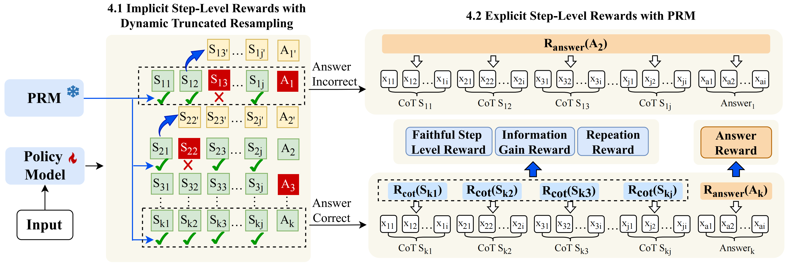

# Stop Rewarding Hallucinated Steps: Faithfulness-Aware Step-Level Reinforcement Learning for Small Reasoning Models

In this paper, we propose **FaithRL**, a reinforcement learning framework for mitigating faithfulness hallucinations in SRMs. By combining implicit step-level rewards from dynamic truncated resampling with explicit PRM-based rewards, FaithRL provides fine-grained supervision to penalize unfaithful CoT reasoning. FaithRL achieves superior performance across multiple SRMs and open-
book QA datasets.<br><br>





## 📂 Project Structure

| File/Directory | Description |
| :--- | :--- |
| `run.bash` | **Main Execution Entry**: The final script to trigger the training process. |
| `examples/run.sh` | **Example Script**: Shell script providing training configurations. |
| `pipeline.py` | **Deployment Script**: Deploys the PRM model (must run before training). |
| `verl/trainer/ppo/my_reward.py` | **Reward Logic**: Custom Step-level reward function implementation. |
| `verl/trainer/ppo/ray_trainer.py` | **Core Trainer**: Ray-based GRPO trainer implementation. |
| `verl/trainer/main_ppo.py` | **Main Entry**: Orchestration logic for the GRPO training loop. |
| `mydata/train.parquet` | **Dataset**: Default training data in Parquet format. |

---

## 🚀 Workflow & Usage
Follow these steps in order to start the training:

### 1. Data Preparation
Ensure your training data is located at the following path:
* **Path**: `mydata/train.parquet`

### 2. Download and Deploy PRM Model
Before starting the training, download and deploy the PRM service to handle reward requests.

Download PRM model from [HHEM-2.1](https://huggingface.co/vectara/hallucination_evaluation_model).

Then, deploy the PRM service using the following command:
python3 pipeline.py

### 3. Start Training
Once the PRM service is live, execute the main bash script to initiate the PPO training process:
bash run.bash
```
